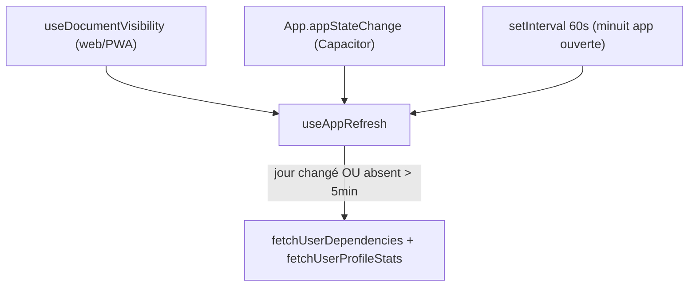

# Refresh de l'app au retour au premier plan

## Contexte / problème

Le temps réel passe par AdonisJS Transmit (SSE) dans [`useSocket.ts`](../apps/web/app/composables/useSocket.ts). Quand l'app passe en arrière-plan, la connexion SSE est suspendue et les événements manqués ne sont pas rejoués au retour : l'état local reste périmé.

Le composable [`useRefreshOnNewDay.ts`](../apps/web/app/composables/useRefreshOnNewDay.ts) ne re-fetch que si le **jour calendaire** a changé (`habitsStore.lastFetchedDateKey !== getTodayDateKey()`), donc une réouverture le même jour ne rafraîchit rien.

**Solution :** un **seul composable bien fait**, `useAppRefresh`, qui regroupe les trois responsabilités auparavant éclatées (détection de retour au premier plan + refresh nouveau jour + refresh périmé). Il déclenche un refetch quand, au retour au premier plan : soit le jour a changé, soit l'app était absente > 5 min. Il garde aussi le check périodique pour le passage de minuit app ouverte.



---

## Décision : un seul composable `useAppRefresh`

On remplace les 3 morceaux prévus (`useAppResume`, `useRefreshOnNewDay`, `useRefreshWhenStale`) par un unique [`useAppRefresh.ts`](../apps/web/app/composables/useAppRefresh.ts). Raisons :

- Mêmes déclencheurs (visibility + Capacitor `appStateChange` + interval minuit).
- Même cible de refetch.
- Une seule source de vérité pour « quand faut-il rafraîchir ».

Le fichier [`useRefreshOnNewDay.ts`](../apps/web/app/composables/useRefreshOnNewDay.ts) est **supprimé** (logique absorbée).

---

## 1. Nouveau composable `useAppRefresh`

**Fichier :** `apps/web/app/composables/useAppRefresh.ts`

`lastHiddenAt` non initialisé → le premier `visible` au montage donne `awayMs = 0` (pas de refetch parasite après le bootstrap). Helpers internes `markHidden` / `handleResume` pour ne pas dupliquer le calcul de `awayMs` entre visibility et Capacitor. Flag `refreshing` anti-concurrence.

```ts
import type { PluginListenerHandle } from '@capacitor/core'
import { App } from '@capacitor/app'
import { getTodayDateKey } from '@resilienceclub/date-helpers'
import { useDocumentVisibility } from '@vueuse/core'

const newDayCheckIntervalMs = 60_000
const staleThresholdMs = 300_000

export default function useAppRefresh() {
  const { isNative } = useCapacitor()
  const habitsStore = useHabitsStore()
  const userStore = useUserStore()

  let refreshing = false

  const refreshIfNeeded = async ({ awayMs }: { awayMs: number }) => {
    // Only refresh once data was already loaded and the user is signed in.
    if (refreshing || !userStore.user) {
      return
    }

    const isNewDay = Boolean(habitsStore.lastFetchedDateKey)
      && habitsStore.lastFetchedDateKey !== getTodayDateKey()
    const isStale = awayMs > staleThresholdMs

    if (!isNewDay && !isStale) {
      return
    }

    refreshing = true
    try {
      await userStore.fetchUserDependencies()
      await userStore.fetchUserProfileStats()
    }
    catch (error) {
      console.error('[AppRefresh] Failed to refresh:', error)
    }
    finally {
      refreshing = false
    }
  }

  if (import.meta.client) {
    let lastHiddenAt: number | undefined

    const markHidden = () => {
      lastHiddenAt = Date.now()
    }

    const handleResume = () => {
      const awayMs = lastHiddenAt ? Date.now() - lastHiddenAt : 0
      lastHiddenAt = undefined
      refreshIfNeeded({ awayMs })
    }

    // Re-check when the tab/PWA comes back to the foreground.
    const visibility = useDocumentVisibility()

    watch(visibility, (state) => {
      if (state === 'hidden') {
        markHidden()
      }
      else if (state === 'visible') {
        handleResume()
      }
    })

    // Detects midnight crossing while the app stays open and foregrounded.
    const intervalId = window.setInterval(() => refreshIfNeeded({ awayMs: 0 }), newDayCheckIntervalMs)

    // Native apps don't fire visibilitychange on resume.
    let resumeListener: PluginListenerHandle | undefined

    if (isNative.value) {
      App.addListener('appStateChange', ({ isActive }) => {
        if (isActive) {
          handleResume()
        }
        else {
          markHidden()
        }
      }).then((listener) => {
        resumeListener = listener
      })
    }

    onScopeDispose(() => {
      window.clearInterval(intervalId)
      resumeListener?.remove()
    })
  }
}
```

**Scope du refetch (choix retenu) :**

- [`fetchUserDependencies()`](../apps/web/app/stores/user.ts) → stats user + dividers + habits
- puis [`fetchUserProfileStats()`](../apps/web/app/stores/user.ts) → habits stats + stats user

Note : `fetchUserStatistics` est appelé deux fois (redondance mineure et sans risque).

---

## 2. Cablage dans `app.vue`

**Fichier :** [`app.vue`](../apps/web/app/app.vue), ligne 20

Remplacer l'appel existant :

```ts
useAppRefresh()
```

(à la place de `useRefreshOnNewDay()`)

---

## Notes

- Comportement par rapport à l'ancien `useRefreshOnNewDay` : sur un changement de jour, on déclenche désormais aussi `fetchUserProfileStats()` en plus de `fetchUserDependencies()` — amélioration voulue (stats d'en-tête à jour).
- Lint/typecheck : depuis un shell agent, prefixer `export PATH="/usr/local/share/nvm/versions/node/v24.14.1/bin:$PATH"` avant `pnpm --filter @resilienceclub/web lint` / `typecheck` si la version Node diffère.

---

## Todos

- [ ] Créer `apps/web/app/composables/useAppRefresh.ts` (visibility + Capacitor + interval minuit + logique nouveau jour / périmé > 5 min)
- [ ] Remplacer `useRefreshOnNewDay()` par `useAppRefresh()` dans `app.vue`
- [ ] Supprimer `apps/web/app/composables/useRefreshOnNewDay.ts`
- [ ] Lancer lint + typecheck sur `@resilienceclub/web`
