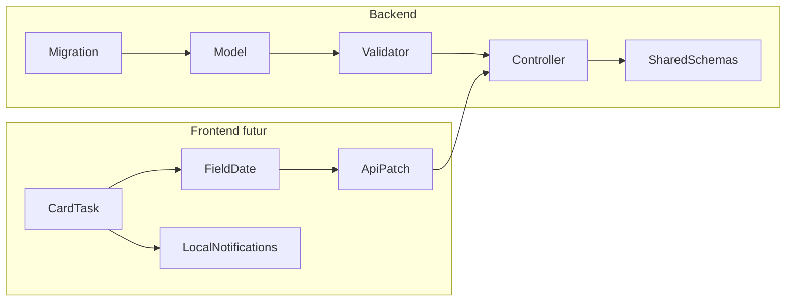

# Date d'échéance pour les tâches (backend + faisabilité frontend)

## Contexte actuel

Le système de tâches est **backend-only** aujourd'hui : CRUD complet avec notes/steps, mais **aucune date d'échéance ni rappel**.

| Couche | Fichiers clés |
|--------|---------------|
| Modèle | [`apps/api/app/models/Task.ts`](../apps/api/app/models/Task.ts) |
| Controller | [`apps/api/app/controllers/TasksController.ts`](../apps/api/app/controllers/TasksController.ts) |
| Validators | [`apps/api/app/validators/tasks/UpdateTaskValidator.ts`](../apps/api/app/validators/tasks/UpdateTaskValidator.ts) |
| Schémas partagés | [`packages/shared/schemas/task.ts`](../../packages/shared/schemas/task.ts), [`packages/shared/schemas/api.ts`](../../packages/shared/schemas/api.ts) |

Sur les habitudes, les « rappels » sont modélisés ainsi (pas d'entité séparée, pas de flag `modifiable`) :

```typescript
// Habit.ts
time: string          // "HH:MM"
timeActive: boolean   // feature activée/désactivée
timeNotification: HabitTimeNotification  // 'disabled' | 'enabled' | '15min'
```

Le « peut-on modifier ou pas » côté UX = **`timeActive`** : toggle dans la barre d'édition, champs visibles seulement en mode édition, badge en lecture seule quand désactivé.

---

## Ce que fait Google Calendar (référence pour les notifications)

Google Calendar **sépare** les rappels des événements horaires et des événements **journée entière** :

- **Événements avec heure** : 5 min, 15 min, 30 min, 1 h avant…
- **Événements journée entière** : rappels basés sur des **jours**, avec une heure fixe (souvent **9h00** dans le fuseau de l'utilisateur) — ex. « le jour même à 9h », « 1 jour avant à 9h », « 1 semaine avant à 9h »

Pour les tâches (date sans heure), le modèle Google Calendar est le bon : **pas de `15min`**, mais des offsets en jours + heure par défaut côté client (9h, fuseau `User.timeZone` déjà présent sur le modèle User).

**Proposition enum backend** (distincte de celle des habitudes) :

```typescript
TaskDeadlineNotificationSchema = z.enum(['disabled', 'onDay', 'dayBefore', 'weekBefore'])
```

| Valeur | Comportement client (plus tard) |
|--------|----------------------------------|
| `disabled` | Pas de notification locale |
| `onDay` | Le jour J à 9h00 (fuseau user) |
| `dayBefore` | La veille à 9h00 |
| `weekBefore` | 7 jours avant à 9h00 |

---

## Modèle proposé pour les tâches

Reprendre le pattern 3 champs des habitudes, adapté à une **date** :

| Champ | Type | Défaut | Rôle |
|-------|------|--------|------|
| `deadline` | `string` | `''` | Date au format `YYYY-MM-DD` (comme `time` est `HH:MM` pour les habitudes) |
| `deadlineActive` | `boolean` | `false` | Active/désactive la section échéance (équivalent `timeActive`) |
| `deadlineNotification` | enum | `'disabled'` | Préférence de rappel (style Google Calendar) |

**Pourquoi `deadline` en string et non en timestamp ?**

- Cohérence avec `habit.time` (valeur métier sans timezone ambiguë)
- Une tâche « échéance le 15 juin » reste le 15 juin quelle que soit la timezone
- Le client calcule l'instant de notification (9h locale) à partir de `deadline` + `deadlineNotification` + `user.timeZone`

**Pas de `deadlineVisibility`** : les habitudes n'ont pas `timeVisibility` non plus — juste un badge en lecture seule.



---

## Implémentation backend (phase 1)

### 1. Migration

Nouveau fichier : `apps/api/database/migrations/1000000000031_add_deadline_fields_to_tasks.ts`

```typescript
table.string('deadline', 10).notNullable().defaultTo('')
table.boolean('deadline_active').notNullable().defaultTo(false)
table.enum('deadline_notification', ['disabled', 'onDay', 'dayBefore', 'weekBefore'])
  .notNullable().defaultTo('disabled')
```

Puis regénérer `database/schema.ts` (commande habituelle du projet).

### 2. Modèle Task

Ajouter les 3 colonnes dans [`Task.ts`](../apps/api/app/models/Task.ts).

### 3. Validator + schémas partagés

- [`UpdateTaskValidator.ts`](../apps/api/app/validators/tasks/UpdateTaskValidator.ts) : ajouter `deadline`, `deadlineActive`, `deadlineNotification` (optionnels)
- [`packages/shared/schemas/task.ts`](../../packages/shared/schemas/task.ts) : exporter `TaskDeadlineNotificationSchema` + champs dans `TaskSchema`
- [`packages/shared/schemas/api.ts`](../../packages/shared/schemas/api.ts) : champs dans `tasks.update.request`

Validation Vine pour `deadline` : regex `^\d{4}-\d{2}-\d{2}$` ou chaîne vide (comme `time` accepte `''`).

### 4. Controller

Dans `updateTask`, reprendre le pattern existant :

```typescript
if (requestData.deadlineActive !== undefined) {
  task.deadlineActive = requestData.deadlineActive
  // pas de visibility à reset (contrairement à notes/steps)
}

if (requestData.deadline !== undefined) {
  task.deadline = requestData.deadline ?? ''
}

if (requestData.deadlineNotification !== undefined) {
  task.deadlineNotification = requestData.deadlineNotification
}
```

Comportement à l'activation (`deadlineActive: true`) côté client : si `deadline` vide, proposer la date du jour (comme les habitudes mettent `00:00` par défaut). Le backend n'a pas besoin de logique spéciale.

### 5. Tests

Mettre à jour :

- [`apps/api/tests/data/keys.ts`](../apps/api/tests/data/keys.ts) — ajouter `deadline`, `deadlineActive`, `deadlineNotification` au tableau `task`
- [`apps/api/tests/services/Generator.ts`](../apps/api/tests/services/Generator.ts) — params optionnels
- [`TasksController.spec.ts`](../apps/api/app/controllers/TasksController.spec.ts) — test `updateTask.updateFields` étendu (round-trip des 3 champs + broadcast)
- [`Task.spec.ts`](../apps/api/app/models/Task.spec.ts) — defaults à la création

---

## Faisabilité frontend (phase 2 — après backend)

**Oui, c'est envisageable**, mais il n'existe **aucune UI tâche** aujourd'hui (`CardTask` absent). Ce sera construit en parallèle du backend, en s'inspirant de [`CardHabit.vue`](../apps/web/app/components/cards/CardHabit.vue).

### Différences clés vs habitudes

| Aspect | Habitudes (`time`) | Tâches (`deadline`) |
|--------|-------------------|-------------------|
| Valeur | Heure `HH:MM` | Date `YYYY-MM-DD` |
| Composant UI | `FieldTime` (existe dans `@saasmakers/ui`) | **`FieldDate` à créer** (copie de `FieldTime` avec `type="date"`) |
| Notifications | Répétitives par jour de la semaine | **Unique**, planifiée une fois à 9h locale |
| ID notification | `habitId * 10 + dayIndex` | `taskId * 10 + offsetIndex` (0=onDay, 1=dayBefore, 2=weekBefore) |
| Resync triggers | jours, heure, activation… | deadline, deadlineActive, deadlineNotification, archive/remove |

### UX proposée (miroir CardHabit)

1. **Barre d'édition** : icône calendrier pour toggle `deadlineActive` (comme l'horloge pour `timeActive`)
2. **Mode édition** : `FieldDate` + `FieldSelect` pour `deadlineNotification` (disabled si pas native, comme les habitudes)
3. **Mode lecture** : badge avec la date formatée localement (ex. « 15 juin ») si `deadlineActive && !isEditing`
4. **Notifications** : réutiliser `useLocalNotifications` + Capacitor `LocalNotifications.schedule` avec `at: Date` calculé depuis `deadline` + offset + 9h + `user.timeZone`

### Composant FieldDate

Créer dans `@saasmakers/ui` en copiant `FieldTime.vue` :

- `type="date"` au lieu de `type="time"`
- Icône calendrier au lieu de horloge
- Export dans `types/fields.d.ts` + `global.d.ts`

Pas besoin de publier `@saasmakers/ui` immédiatement si les tâches ne sont pas encore en prod — patch local ou bump catalog quand prêt.

### Store tâches (à créer)

Nouveau `apps/web/app/stores/tasks.ts` sur le modèle de [`habits.ts`](../apps/web/app/stores/habits.ts) : `updateTask` passe `deadline`, `deadlineActive`, `deadlineNotification` au PATCH.

---

## Hors scope (pour l'instant)

- Filtrage/tri par échéance (`?overdue=true`) — utile plus tard, pas nécessaire pour la première itération
- Notifications multiples simultanées (Google Calendar permet d'en ajouter plusieurs) — une seule préférence enum suffit pour le MVP
- Acceptation de `deadline` à la création (`CreateTaskValidator`) — peut rester update-only comme `time` sur les habitudes

---

## Ordre d'exécution recommandé

1. **Backend complet** (migration → modèle → validators → schémas → controller → tests)
2. **`FieldDate`** dans `@saasmakers/ui`
3. **UI tâches** (`CardTask`, store, notifications) quand la page tâches sera développée

---

## Todos

- [ ] Créer migration `1000000000031_add_deadline_fields_to_tasks.ts` (deadline, deadline_active, deadline_notification)
- [ ] Mettre à jour Task model, UpdateTaskValidator, task.ts, api.ts avec TaskDeadlineNotificationSchema
- [ ] Ajouter gestion deadline/deadlineActive/deadlineNotification dans TasksController.updateTask
- [ ] Mettre à jour keys.ts, Generator, TasksController.spec, Task.spec
- [ ] (Phase 2) Créer FieldDate dans @saasmakers/ui sur le modèle FieldTime
- [ ] (Phase 2) CardTask + store tasks + notifications Capacitor style Google Calendar
