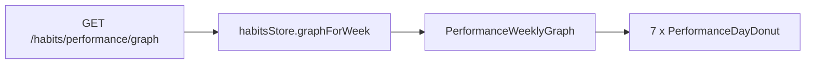

# Donuts hebdomadaires — graphe « Cette semaine »

## Contexte / problème

Sur la page **Performances** (`/habits/performance`), la section **« Cette semaine »** affiche aujourd’hui un graphe en **barres empilées** (Chartist) : une barre par jour, avec la part faite (indigo) et la part restante (gris).

**Objectif :** remplacer ces barres par **un donut par jour**, où chaque habitude prévue ce jour-là correspond à **un arc égal** sur l’anneau — les parts faites en indigo, les parts non faites en gris.

**Choix validé : option A** — un arc par habitude (N parts égales), pas seulement 2 parts (fait / pas fait).

**Exemple :** mardi, 5 habitudes prévues, 3 faites → anneau en **5 parts égales** : 3 indigo + 2 gris.

---

## État actuel du code

| Élément | Fichier |
|---------|---------|
| Graphe hebdomadaire (barres) | [`PerformanceWeeklyGraph.vue`](../apps/web/app/components/performance/PerformanceWeeklyGraph.vue) |
| Page performances | [`HabitsPerformanceMetrics.vue`](../apps/web/app/components/habits/HabitsPerformanceMetrics.vue) → [`performance.vue`](../apps/web/app/pages/habits/performance.vue) |
| Données par jour | [`HabitsGraphDaySchema`](../packages/shared/schemas/habit.ts) : `completed`, `total`, `percentage`, `future` |
| API (inchangée) | [`HabitsPerformanceController.fetchHabitsGraph`](../apps/api/app/controllers/HabitsPerformanceController.ts) |
| Référence couleurs | [`HabitsBlock.vue`](../apps/web/app/components/habits/HabitsBlock.vue) (`isGraphDayBlock` + paliers indigo) |

Le composant actuel utilise `BaseChart` type `bar` avec 2 séries (`percentage` + `100 - percentage`) et ~80 lignes de CSS `.ct-*`.

---

## Comportement cible

Pour chaque jour (lun → dim) :

- Anneau découpé en **`total` segments égaux** (une place par habitude du jour)
- **`completed` segments** remplis en **indigo** (teinte selon `percentage`, comme `HabitsBlock`)
- **`total - completed` segments** en **gris** (`gray-300` / `gray-700` en dark mode)
- **`future: true`** : style atténué (opacité ou bordure pointillée)
- **`total === 0`** : anneau neutre / vide (aucune habitude ce jour-là)
- Sous chaque donut : libellé jour (Lun…Dim) + si `!hideTotal` : `percentage%` et `(completed/total)`

**Limite connue (hors scope) :** on ne sait pas *quelle* habitude est quelle part — seulement le nombre fait / pas fait. Une version avec nom/couleur par habitude nécessiterait une extension API.

---

## Plan d’implémentation

### 1. Créer `PerformanceDayDonut.vue`

**Fichier :** `apps/web/app/components/performance/PerformanceDayDonut.vue`

- Props : `day: HabitsGraphDay`, `dayLabel: string`, `hideTotal?: boolean`, `date?: string`
- Rendu **SVG** (anneau avec `stroke` + `stroke-dasharray` / rotation par segment) — pas 7 instances Chartist `pie`
- Helpers internes :
  - `buildSegments(total, completed)` → `{ filled: boolean }[]`
  - `getSegmentColor(percentage, filled)` → couleurs indigo alignées sur `HabitsBlock`
- Tooltip : `v-tooltip` (même pattern que `HabitsBlock`)
- Centre du donut (optionnel) : pourcentage court si lisible sur mobile

### 2. Refactor `PerformanceWeeklyGraph.vue`

- Supprimer : `BaseChart`, `useChartist`, `chartData`, `chartOptions`, `watch` sur `draw`, tout le CSS `.ct-*`
- Remplacer par une grille responsive : 7 donuts + labels en dessous
- **Ordre des jours** : tableau ordonné (tri par date ou mapping fixe lun→dim) — ne pas se fier à `Object.keys` seul
- Conserver `BaseDivider` + i18n `thisWeek`
- Tailles : ~40–48px mobile, ~56px desktop

### 3. Types (optionnel)

**Fichier :** [`performance.d.ts`](../apps/web/app/types/performance.d.ts) — interface `PerformanceDayDonut` si utile.

### 4. Pas de changement backend

Store [`habits.ts`](../apps/web/app/stores/habits.ts) et API inchangés.

`hideTotal` (vue habitude unique) : masquer le texte `(x/y)` et `%` sous le donut ; le donut reste 0/1 segment si une seule habitude.

---

## Fichiers touchés

| Fichier | Action |
|---------|--------|
| `apps/web/app/components/performance/PerformanceDayDonut.vue` | Créer |
| `apps/web/app/components/performance/PerformanceWeeklyGraph.vue` | Refactor |
| `apps/web/app/types/performance.d.ts` | Optionnel |

---

## Vérification manuelle

1. Ouvrir `/habits/performance` connecté, section « Cette semaine »
2. Jour avec 0 habitudes → anneau neutre
3. Jour partiel (ex. 2/5) → 5 parts, 2 indigo + 3 gris
4. Jour 100 % → anneau entièrement indigo foncé
5. Jour futur → style atténué
6. Dark mode : contrastes gris/indigo OK
7. Mobile : 7 donuts lisibles sans scroll horizontal excessif

---

## Todos

- [ ] Créer `PerformanceDayDonut.vue` (SVG, N segments, couleurs HabitsBlock, tooltip)
- [ ] Refactor `PerformanceWeeklyGraph.vue` : grille 7 donuts, ordre jours fixe, retirer Chartist/CSS barres
- [ ] Ajuster `performance.d.ts` si besoin + vérification visuelle page `/habits/performance`
